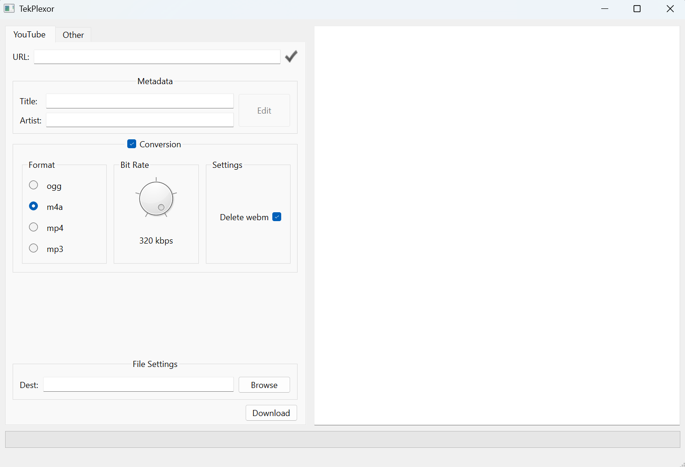

<!-- PROJECT LOGO -->
<div align="center">
<h1 align="center">TekPlexor</h1>

  <p align="center">
    High quality audio download tool
    <br />
  </p>
</div>


<!-- TABLE OF CONTENTS -->
<details>
  <summary>Table of Contents</summary>
  <ol>
    <li>
      <a href="#about-the-project">About The Project</a>
      <ul>
        <li><a href="#built-with">Built With</a></li>
      </ul>
    </li>
    <li>
      <a href="#getting-started">Getting Started</a>
      <ul>
        <li><a href="#prerequisites">Prerequisites</a></li>
        <li><a href="#installation">Installation</a></li>
      </ul>
    </li>
    <li><a href="#usage">Usage</a></li>
    <li><a href="#resources">Resources</a></li>
    <li><a href="#license">License</a></li>
    <li><a href="#contact">Contact</a></li>
    <li><a href="#acknowledgments">Acknowledgments</a></li>
  </ol>
</details>


<!-- ABOUT THE PROJECT -->
## About The Project

TekPlexor was inspired by the lack of online audio downloading tools. 
Existing tools make it difficult to retrieve multiple songs at once and are often low quality. 

TekPlexor eliminates the hassle with an easy-to-use interface, leveraging ffmpeg under the hood
to bring out the best sound.

### Built With

* Python Language
* PyQt6
* PyTubeFix

## User Interface



<!-- GETTING STARTED -->
## Getting Started - Development

### Prerequisites

* Python 3.10–3.12 (3.12 recommended)
* [ffmpeg](https://ffmpeg.org/download.html) available on your PATH

### Installation

From the repository directory:

```sh
python3.12 -m venv .venv
source .venv/bin/activate  # Windows: .venv\Scripts\activate
python -m pip install -r requirements.txt
```

PyTubeFix 11.2.0 supports the current YouTube playlist layout; older versions
can return an empty playlist for a valid shared link.

### Usage

Run from the repository directory so UI icons can be found:

```sh
python main.py
```

In the **YouTube** tab, paste a video or shared playlist URL. Wait for the green
checkmark, review the tracks with **Edit Metadata**, select a destination folder,
and click **Download**. The same tab handles both videos and playlists.
Conversion is enabled by default with M4A at 320 kbps and source-file deletion.
Uncheck **Conversion** to keep the downloaded audio without transcoding.
Existing converted files are preserved and reported in the debug console.

### Validation and CI

```sh
python -m pip install -r requirements-dev.txt
python scripts/run_tests.py
python -m coverage report
```

Tests use deterministic audio fixtures, real FFmpeg conversion, and offscreen Qt
workers/editor interactions. Live YouTube checks are opt-in:

```sh
python scripts/live_smoke.py --vpn-confirmed --playlist "$TEK_PLEXOR_TEST_URL"
```

CI covers Linux, macOS, Windows, and Python 3.10–3.12; it checks dependencies,
secrets, medium/high static security findings, fatal lint, and an 80% coverage
floor before building executable artifacts. Dependabot proposes weekly updates.

See [validation and known limitations](docs/VALIDATION.md), the
[security review](docs/SECURITY_REVIEW.md), and the
[prioritized approval backlog](docs/OPTIMIZATION_BACKLOG.md). Three reproduced
edge-case defects are explicitly marked expected failures awaiting backlog fixes.
An administrator must enable required status checks after the first hosted run.

### Development
Start by activating the virtual environment

##### Mac
```sh
source .venv/bin/activate
```
##### Windows
```sh
.venv\Scripts\activate
```

The optional Qt Designer editor is available with a separate Qt installation.
pyqt6 .ui files can be found under **tek-plexor/tp_interface/ui**. Once you have saved new changes in designer, convert the .ui file to Python with the following command **from the tp_interface directory**...
```sh
pyuic6 -o main_window_ui.py -x ui/main_window.ui
```

<!-- RESOURCES -->
## Resources
[Pytube Docs](https://pytube.io/en/latest/api.html)

[WEBM to MP3](https://stackoverflow.com/questions/72679106/how-to-convert-in-memory-webm-audio-file-to-mp3-audio-file-in-python)

[FFMPEG Encodings](https://trac.ffmpeg.org/wiki/Encode/HighQualityAudio)

[MP4 Tags (Mutagen)](https://mutagen.readthedocs.io/en/latest/api/mp4.html)

[Opus Tags](https://www.opus-codec.org/docs/)

[eyed3 Docs](https://eyed3.readthedocs.io/en/latest/)

[Youtube Formats](https://gist.github.com/AgentOak/34d47c65b1d28829bb17c24c04a0096f)

<!-- LICENSE -->
## License

See `LICENSE` for more information.


<!-- CONTACT -->
## Contact

Nick Matthews - nickd.mf7@gmail.com 
Soma Szabo - soma.szabo15@gmail.com 

Project Link: [https://github.com/dj-devtek/tek-plexor](https://github.com/dj-devtek/tek-plexor)

<p align="right">(<a href="#top">back to top</a>)</p>

Live downloads are exceptional and local-only: activate and verify a VPN before setting `TEK_PLEXOR_TEST_URL` and using `--vpn-confirmed`. CI uses offline fixtures. See [GitHub setup](docs/GITHUB_SETUP.md) for a reference-only single-track candidate and merge protection instructions.
